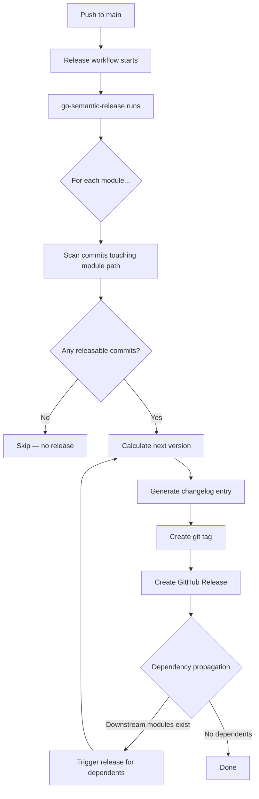
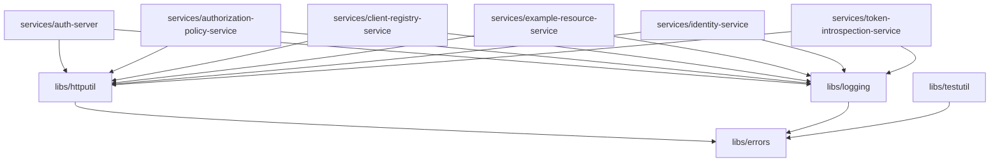

# Identity Platform Go

A production-style **OAuth 2.0 / OIDC** reference platform built in Go, demonstrating a pure microservices architecture with clean design principles. Each service is independently deployable with its own module, configuration, and in-memory data store.

---

## Table of Contents

- [Overview](#overview)
- [Architecture](#architecture)
- [Service Map](#service-map)
- [Services](#services)
- [Shared Libraries](#shared-libraries)
- [Design Patterns](#design-patterns)
- [Getting Started](#getting-started)
- [Configuration](#configuration)
- [API Reference](#api-reference)
- [Testing](#testing)
- [Swagger / API Documentation](#swagger--api-documentation)
- [Project Structure](#project-structure)
- [Architecture Decision Records](#architecture-decision-records)
- [Release Process](#release-process)
- [License](#license)

---

## Overview

This repository is a **reference implementation** that showcases how to build a scalable identity and access management platform using:

- **Hexagonal Architecture** (Ports & Adapters) with strict dependency direction
- **Go Workspaces** for monorepo management across independent modules
- **Strategy Pattern** for extensible OAuth 2.0 grant type handling
- **Specification Pattern** for fine-grained authorization policy evaluation
- **Zero external dependencies** for local development (all persistence is in-memory)

The platform implements core OAuth 2.0 flows including token issuance, introspection, and revocation, along with user identity management, client registration, and resource protection via JWT-based authentication.

---

## Architecture

All services follow the **Ports and Adapters** (Hexagonal) architecture with a strict dependency direction:

```
domain  -->  application  -->  ports  -->  adapters
```

| Layer         | Responsibility                                                        |
|---------------|-----------------------------------------------------------------------|
| **Domain**    | Pure business models and repository interfaces. No framework imports. |
| **Application** | Business logic. Depends only on domain interfaces.                 |
| **Ports**     | Inbound and outbound port interfaces.                                 |
| **Adapters**  | Infrastructure implementations (HTTP handlers, in-memory repos, JWT). |

This design ensures that business logic is framework-agnostic, independently testable, and that infrastructure can be swapped without modifying core logic.

---

## Service Map

```
┌──────────────────────────────────────────────────────────────────────────┐
│                          Identity Platform                               │
│                                                                          │
│   Client App ──> auth-server (:8080) ──> identity-service (:8081)       │
│                       │                                                  │
│                       v                                                  │
│               client-registry-service (:8082)                            │
│                                                                          │
│   token-introspection-service (:8083)                                    │
│   authorization-policy-service (:8084)                                   │
│                                                                          │
│   example-resource-service (:8085)  <-- protected API                   │
└──────────────────────────────────────────────────────────────────────────┘
```

All inter-service communication is over **HTTP**. There is no shared database between services.

---

## Services

### auth-server (`:8080`)

The core OAuth 2.0 authorization server. Issues access tokens, performs token introspection, and handles token revocation.

- Implements `client_credentials` grant type (fully functional)
- `authorization_code` and `refresh_token` grants are stubbed for extension
- Uses the **Strategy Pattern** via a `GrantStrategyRegistry` to route grant requests
- JWT token generation with configurable signing key, issuer, and TTL

### identity-service (`:8081`)

Handles user registration and authentication. Provides bcrypt-based password hashing with an in-memory user store.

### client-registry-service (`:8082`)

Manages OAuth 2.0 client registrations. Provides full CRUD operations and client credential validation.

### token-introspection-service (`:8083`)

Standalone JWT token validation and metadata extraction per [RFC 7662](https://datatracker.ietf.org/doc/html/rfc7662).

### authorization-policy-service (`:8084`)

Fine-grained authorization using the **Strategy** and **Specification** patterns. Evaluates RBAC policies against subjects and resources.

### example-resource-service (`:8085`)

A protected API that demonstrates JWT-based authentication and scope enforcement. Requires valid tokens with appropriate scopes (`read`, `write`) to access resources.

---

## Shared Libraries

Located in `libs/`, these are independent Go modules shared across services:

| Library          | Purpose                                            |
|------------------|----------------------------------------------------|
| `libs/logging`   | Structured `slog`-based logging with trace ID support |
| `libs/errors`    | Typed application errors with HTTP status mapping  |
| `libs/httputil`  | HTTP response helpers and middleware               |
| `libs/testutil`  | Testing utilities                                  |

---

## Design Patterns

| Pattern                    | Where Used                                          |
|----------------------------|-----------------------------------------------------|
| **Strategy**               | Grant type handling, token generation, password hashing |
| **Repository**             | Data access abstraction in domain interfaces        |
| **Adapter**                | HTTP handlers, outbound adapters                    |
| **Chain of Responsibility**| HTTP middleware pipeline                            |
| **Specification**          | Policy evaluation rules                             |
| **Registry / Factory**     | Grant strategy registry                             |

---

## Getting Started

### Prerequisites

- **Go 1.24+**
- **[Task](https://taskfile.dev/)** (task runner) - optional but recommended
- **[swag](https://github.com/swaggo/swag)** (Swagger doc generation) - optional, needed only for `task swagger`

### Run a Service

Each service can be run independently:

```bash
# Using Task
task run:auth-server
task run:identity-service
task run:client-registry-service

# Or directly with Go
cd services/auth-server && go run ./cmd/...
```

### Quick Test: Issue a Token

```bash
# Start the auth server
task run:auth-server

# Request a token using client_credentials grant
curl -s -X POST http://localhost:8080/oauth/token \
  -d "grant_type=client_credentials" \
  -d "client_id=test-client" \
  -d "client_secret=test-secret" \
  -d "scope=read"
```

### Build All Services

```bash
task build
# Binaries are output to bin/
```

---

## Configuration

Each service is configured via environment variables with a service-specific prefix, or through a `config.yaml` file loaded by [Viper](https://github.com/spf13/viper).

### auth-server

| Variable                  | Default                   | Description              |
|---------------------------|---------------------------|--------------------------|
| `AUTH_SERVER_HOST`        | `0.0.0.0`                | Server bind host         |
| `AUTH_SERVER_PORT`        | `8080`                   | Server port              |
| `AUTH_JWT_SIGNING_KEY`    | `change-me-in-production`| JWT HMAC signing key     |
| `AUTH_JWT_ISSUER`         | `identity-platform`      | JWT issuer claim         |
| `AUTH_TOKEN_TTL_SECONDS`  | `3600`                   | Token time-to-live       |
| `AUTH_LOG_LEVEL`          | `info`                   | Log level                |

### identity-service

| Variable                   | Default       | Description      |
|----------------------------|---------------|------------------|
| `IDENTITY_SERVER_HOST`     | `0.0.0.0`    | Server bind host |
| `IDENTITY_SERVER_PORT`     | `8081`        | Server port      |

### client-registry-service

| Variable                   | Default       | Description      |
|----------------------------|---------------|------------------|
| `CLIENT_SERVER_HOST`       | `0.0.0.0`    | Server bind host |
| `CLIENT_SERVER_PORT`       | `8082`        | Server port      |

### token-introspection-service

| Variable                      | Default | Description          |
|-------------------------------|---------|----------------------|
| `INTROSPECT_SERVER_PORT`      | `8083`  | Server port          |
| `INTROSPECT_JWT_SIGNING_KEY`  | -       | JWT HMAC signing key |

### authorization-policy-service

| Variable              | Default | Description |
|-----------------------|---------|-------------|
| `POLICY_SERVER_PORT`  | `8084`  | Server port |

### example-resource-service

| Variable                    | Default | Description          |
|-----------------------------|---------|----------------------|
| `RESOURCE_SERVER_PORT`      | `8085`  | Server port          |
| `RESOURCE_JWT_SIGNING_KEY`  | -       | JWT HMAC signing key |

---

## API Reference

### auth-server

| Method | Path                | Description                    |
|--------|---------------------|--------------------------------|
| POST   | `/oauth/token`      | Issue access token (RFC 6749)  |
| GET    | `/oauth/authorize`  | Authorization endpoint (stub)  |
| POST   | `/oauth/introspect` | Token introspection (RFC 7662) |
| POST   | `/oauth/revoke`     | Token revocation (RFC 7009)    |
| GET    | `/health`           | Health check                   |

### identity-service

| Method | Path              | Description         |
|--------|-------------------|---------------------|
| POST   | `/auth/register`  | Register a new user |
| POST   | `/auth/login`     | Authenticate a user |
| GET    | `/health`         | Health check        |

### client-registry-service

| Method | Path                  | Description                 |
|--------|-----------------------|-----------------------------|
| POST   | `/clients`            | Register a new OAuth client |
| GET    | `/clients`            | List all registered clients |
| GET    | `/clients/{id}`       | Get a specific client       |
| DELETE | `/clients/{id}`       | Delete a client             |
| POST   | `/clients/validate`   | Validate client credentials |
| GET    | `/health`             | Health check                |

### token-introspection-service

| Method | Path          | Description      |
|--------|---------------|------------------|
| POST   | `/introspect` | Introspect token |
| GET    | `/health`     | Health check     |

### authorization-policy-service

| Method | Path        | Description              |
|--------|-------------|--------------------------|
| POST   | `/evaluate` | Evaluate authorization   |
| GET    | `/health`   | Health check             |

### example-resource-service

| Method | Path              | Description                          |
|--------|-------------------|--------------------------------------|
| GET    | `/resources`      | List resources (requires `read`)     |
| GET    | `/resources/{id}` | Get resource by ID (requires `read`) |
| POST   | `/resources`      | Create resource (requires `write`)   |
| GET    | `/health`         | Health check (no auth)               |

---

## Testing

```bash
# Run all tests (unit + integration)
task test

# Unit tests only (with race detection and coverage)
task test:unit

# Integration tests only
task test:integration
```

### Other Task Commands

```bash
task lint        # Run golangci-lint
task format      # Format code with gofmt and goimports
task mocks       # Generate mocks (go generate)
task tidy        # Sync go.work and tidy all modules
task clean       # Remove build artifacts
```

---

## Swagger / API Documentation

Every service ships with interactive [Swagger UI](https://swagger.io/tools/swagger-ui/) documentation, powered by [swaggo/swag](https://github.com/swaggo/swag). Start a service and open its Swagger UI in your browser:

| Service                      | Swagger UI URL                                        |
|------------------------------|-------------------------------------------------------|
| auth-server                  | [http://localhost:8080/swagger/index.html](http://localhost:8080/swagger/index.html) |
| identity-service             | [http://localhost:8081/swagger/index.html](http://localhost:8081/swagger/index.html) |
| client-registry-service      | [http://localhost:8082/swagger/index.html](http://localhost:8082/swagger/index.html) |
| token-introspection-service  | [http://localhost:8083/swagger/index.html](http://localhost:8083/swagger/index.html) |
| authorization-policy-service | [http://localhost:8084/swagger/index.html](http://localhost:8084/swagger/index.html) |
| example-resource-service     | [http://localhost:8085/swagger/index.html](http://localhost:8085/swagger/index.html) |

### Regenerating Swagger Docs

If you modify handler annotations or request/response types, regenerate the docs:

```bash
# All services at once
task swagger

# Or a single service
task swagger:auth-server
task swagger:identity-service
task swagger:client-registry-service
task swagger:token-introspection-service
task swagger:authorization-policy-service
task swagger:example-resource-service
```

This requires the `swag` CLI tool:

```bash
go install github.com/swaggo/swag/cmd/swag@latest
```

---

## Project Structure

```
identity-platform-go/
├── go.work                          # Go workspace definition
├── Taskfile.yml                     # Task runner configuration
├── docs/
│   ├── README.md                    # Architecture documentation
│   └── adr/                         # Architecture Decision Records
│       ├── 0001-use-ports-and-adapters.md
│       ├── 0002-use-go-workspaces.md
│       ├── 0003-use-strategy-pattern-for-grants.md
│       └── 0004-in-memory-persistence-for-reference.md
├── libs/
│   ├── errors/                      # Typed application errors
│   ├── httputil/                    # HTTP helpers and middleware
│   ├── logging/                     # Structured slog-based logging
│   └── testutil/                    # Test utilities
└── services/
    ├── auth-server/                 # OAuth2 authorization server
    │   ├── cmd/main.go
    │   ├── docs/                    # Generated Swagger specs
    │   └── internal/
    │       ├── adapters/            # HTTP handlers, in-memory repos
    │       ├── application/         # Grant strategies, token service
    │       ├── config/              # Viper-based configuration
    │       ├── container/           # Dependency injection
    │       ├── domain/              # Token, client, grant models
    │       ├── observability/       # Logging setup
    │       └── ports/               # Inbound & outbound interfaces
    ├── identity-service/            # User registration & auth
    ├── client-registry-service/     # OAuth client management
    ├── token-introspection-service/ # JWT validation (RFC 7662)
    ├── authorization-policy-service/# RBAC policy evaluation
    └── example-resource-service/    # Protected resource API
```

---

## Architecture Decision Records

Key design decisions are documented in `docs/adr/`:

| ADR | Decision |
|-----|----------|
| [ADR-0001](docs/adr/0001-use-ports-and-adapters.md) | Use Ports and Adapters (Hexagonal) architecture for all services |
| [ADR-0002](docs/adr/0002-use-go-workspaces.md) | Use Go Workspaces for monorepo management |
| [ADR-0003](docs/adr/0003-use-strategy-pattern-for-grants.md) | Use Strategy Pattern for OAuth2 grant type handling |
| [ADR-0004](docs/adr/0004-in-memory-persistence-for-reference.md) | Use in-memory persistence for the reference implementation |

---

## Release Process

This repository uses **independent versioning** — each service and shared library has its own version number and is released separately. Releases are automated via [go-semantic-release](https://github.com/jedi-knights/go-semantic-release), a native Go implementation of the [semantic-release](https://github.com/semantic-release/semantic-release) specification.

### Key Concepts

#### Independent versioning — each module releases on its own schedule

Each service and library maintains its own semantic version tracked via its own tag prefix (e.g., `auth-server/v1.3.0`, `errors/v0.3.1`). A release only occurs for a module if there are **releasable commits that touch its path** since its last tag.

- A commit to `services/auth-server/` bumps `auth-server` only.
- A commit to `services/identity-service/` bumps `identity-service` only.
- A commit to `docs/` or `Taskfile.yml` bumps nothing — those paths belong to no module.

**In practice:** you can merge ten PRs in a row and each service will only receive a version bump when its own code changes. Services with no new commits since their last release are skipped entirely.

#### Dependency propagation — library changes cascade to dependent services

When a shared library is released, every service that declares it as a dependency is **also released in the same run** — even if that service has no new commits of its own. This is controlled by `dependency_propagation: true` in `.semantic-release.yaml`.

**Why this matters:** if `libs/errors` ships a new minor version, all six services that depend on it (through `libs/httputil` and `libs/logging`) receive a patch-level version bump. This ensures every service tag always reflects the version of its dependencies at release time — there is never a published tag that silently points at a newer library than intended.

**Cascade example:** a `feat:` commit to `libs/errors` triggers:
1. `errors` → minor bump (e.g., `errors/v0.2.0` → `errors/v0.3.0`)
2. `httputil`, `logging`, `testutil` → patch bump (they depend on `errors`)
3. All six services → patch bump (they depend on `httputil` and `logging`)

No service code needs to change for steps 2 and 3 to happen.

### How Releases Are Triggered

A release is triggered automatically when a commit is pushed to `main`. The release tool analyzes the commit history since the last tag for each module and determines whether a release is needed based on [Conventional Commits](https://www.conventionalcommits.org/).

| Commit type | Effect |
|---|---|
| `feat:` | Minor version bump (`v1.2.0` → `v1.3.0`) |
| `fix:`, `perf:`, `refactor:` | Patch version bump (`v1.2.0` → `v1.2.1`) |
| `feat!:` or `BREAKING CHANGE:` footer | Major version bump (`v1.2.0` → `v2.0.0`) |
| `chore:`, `docs:`, `style:`, `ci:`, `test:` | No release |



### Module Dependency Graph

The following graph shows which modules depend on which. When a library is released, all modules that depend on it are also scheduled for release in the same run — even if they have no new commits of their own. This ensures dependents are always tagged against the latest version of their dependencies.



> Arrows mean "depends on". A change to `libs/errors` will propagate all the way through to every service.

### Tag Format

Each module uses a short, flat tag prefix defined in `.semantic-release.yaml`. Tags follow the pattern `<prefix>v<version>`.

| Module | Tag prefix | Example tag |
|---|---|---|
| `services/auth-server` | `auth-server/` | `auth-server/v1.3.0` |
| `services/authorization-policy-service` | `authorization-policy-service/` | `authorization-policy-service/v1.0.2` |
| `services/client-registry-service` | `client-registry-service/` | `client-registry-service/v0.4.1` |
| `services/example-resource-service` | `example-resource-service/` | `example-resource-service/v1.1.0` |
| `services/identity-service` | `identity-service/` | `identity-service/v2.0.0` |
| `services/token-introspection-service` | `token-introspection-service/` | `token-introspection-service/v1.0.0` |
| `libs/errors` | `errors/` | `errors/v0.3.1` |
| `libs/httputil` | `httputil/` | `httputil/v0.2.0` |
| `libs/logging` | `logging/` | `logging/v0.2.0` |
| `libs/testutil` | `testutil/` | `testutil/v0.1.0` |

The prefix is intentionally short (the service name only, not the full path) so tags are readable in the GitHub Releases list and in `git tag -l`. Using the full path (`services/auth-server/v1.3.0`) would make tags unnecessarily verbose and harder to filter.

### Release Configuration

The release configuration lives in `.semantic-release.yaml` at the repository root. The key sections are:

```yaml
release_mode: independent          # each module is versioned independently
dependency_propagation: true       # a lib release cascades to dependent services

projects:
  - name: auth-server              # human-readable name, used in logs and releases
    path: services/auth-server     # path used for commit impact analysis
    tag_prefix: "auth-server/"     # prefix applied to all tags for this module
    dependencies:                  # modules that trigger a re-release of this one
      - errors
      - httputil
      - logging
```

Each project entry defines three things:

- **`path`** — the directory prefix used to determine whether a commit touches this module. Any file changed under `services/auth-server/` counts as a change to `auth-server`.
- **`tag_prefix`** — the string prepended to the version number when creating a git tag or GitHub Release. Must end with `/`.
- **`dependencies`** — names of other modules in this config. When a dependency is released, this module is also released (even with no new commits) to ensure its tag always reflects the latest upstream version.

### Branch Policy

| Branch | Release type | Version format |
|---|---|---|
| `main` | Stable | `v1.2.3` |
| `beta` | Prerelease | `v1.2.3-beta.1` |

Only commits merged to `main` produce stable releases. The `beta` branch can be used to ship prerelease versions for testing before merging.

### GitHub Repository Setup

The release workflow requires the following configuration in your GitHub repository.

#### Required Secret

| Secret | Where to get it | Purpose |
|---|---|---|
| `GITHUB_TOKEN` | Provided automatically by GitHub Actions | Create tags and GitHub Releases |

`GITHUB_TOKEN` is provisioned automatically in every Actions run — no manual setup is required. The workflow already requests `contents: write` and `pull-requests: write` permissions, which are the only permissions needed.

> If you ever replace `GITHUB_TOKEN` with a fine-grained PAT (for example, to allow cross-repository operations), the PAT needs **Contents: Read and write** and **Metadata: Read** scopes on this repository.

#### Repository Settings

Navigate to **Settings → Actions → General** and confirm:

- **Workflow permissions** is set to `Read and write permissions`
- **Allow GitHub Actions to create and approve pull requests** is checked

Without write permissions, the workflow will fail at the tagging step.

### Running Releases Locally

You can run the release tool locally without publishing anything using dry-run mode. This is useful to preview what would be released before merging to main.

```bash
# Install the release tool
task deps

# Preview all releases (no mutations)
semantic-release --dry-run --no-ci

# Confirm which modules are discovered
semantic-release detect-projects --no-ci

# Target a single module
semantic-release --project auth-server --dry-run --no-ci
```

`--no-ci` is required outside of CI because the tool defaults to dry-run when it cannot detect a CI environment. Without it, you must also set `GH_TOKEN`.

---

## License

This project is a reference implementation for educational and demonstration purposes.
