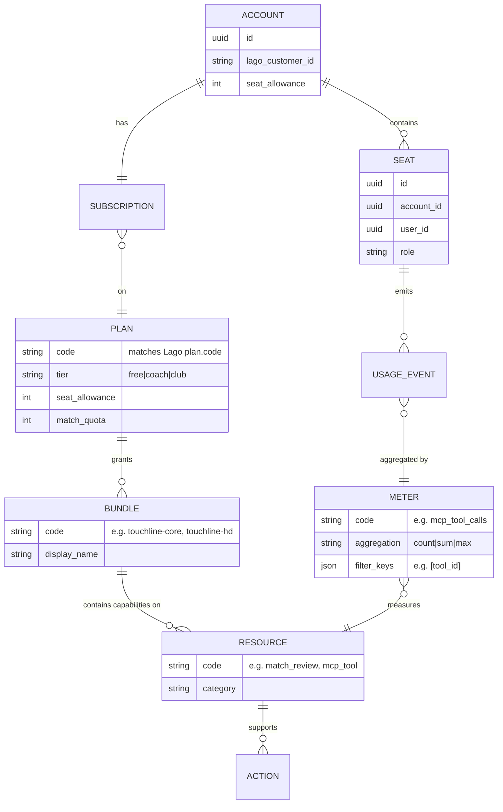
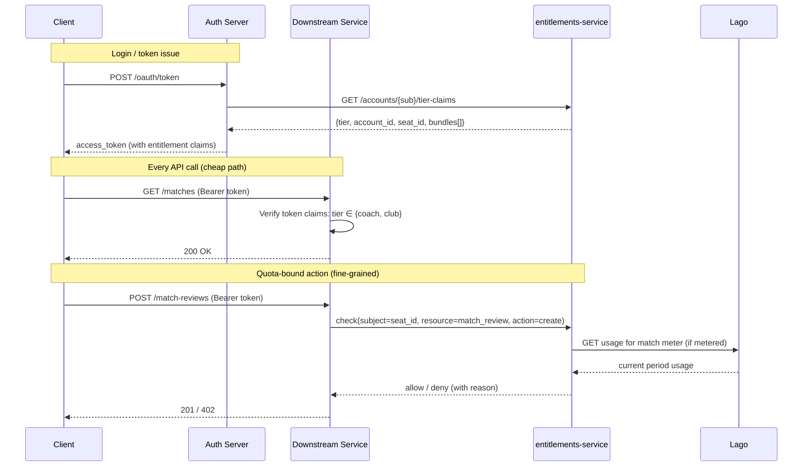

# ADR-0028: Entitlements model — account, check location, bundles, catalog, meter

**Status**: Accepted
**Date**: 2026-07-27

> **Note on numbering.** Issue [#154](https://github.com/jedi-knights/identity-platform-go/issues/154) titled this ADR "0020". That slot was taken by ADR-0020 (Authorization Server Issuer Identification) before Epic 3 was scheduled. This ADR takes the next available number (0028); the entitlements body is unchanged.

## Context

Epic 3 (#140) introduces `entitlements-service`. Before writing schema
(#155) or seed data (#156), five foundational decisions need to be
recorded so future contributors do not re-litigate them and the
downstream design is anchored.

The five decisions:

1. **Account model** — what is the billing/entitlement unit?
2. **Check location** — where does "is this actor entitled to X?" execute?
3. **Bundle shape** — how are individual entitlements grouped for sale?
4. **Catalog home** — which service owns the entitlement catalog?
5. **Meter shape** — how are usage meters modeled?

This ADR names each decision, cites the rejected alternative, and gives
the reason. It composes with:

- [ADR-0019](./0019-usage-accounting-and-billing.md) — Lago/Stripe as the billing engine
- [ADR-0027](./0027-entitlements-enforces-quota-lago-prices.md) — `entitlements-service` enforces; Lago prices

## Diagrams

### Entity model

### Check flow (hybrid)

## Decisions

### 1. Account model — multi-seat account is the entitlement unit

**Decision:** an `account` (billing entity, 1:1 with a Lago customer)
contains one-to-many `seat` records (one per member user). Entitlements
attach to the account; individual users get access through their seat.

**Rejected:** single-user subscriptions where each user directly holds a
plan. Would have simplified the schema (drop the seat table) but breaks
the moment the Club plan needs 10 users under one bill. Would have
required per-user Stripe customers, per-user Lago subscriptions, and
per-user reconciliation — 10× the accounting for the same commercial
outcome.

**Rationale:**
- Matches `touchline-club` at $49/mo for 10 seats — one price, one
  invoice, ten users. Any other model duplicates plumbing to bolt this
  on.
- Matches how organizations buy — the buyer (billing owner) is rarely
  the primary user, especially for Club.
- Seat count is enforced by `entitlements-service` reading
  `plan.metadata.seat_allowance` (per ADR-0027) — no need for Lago to
  understand seats.
- Free/Coach tiers still fit — they're just accounts with seat_allowance=1.

### 2. Check location — hybrid (claims for coarse, live call for fine)

**Decision:** entitlement checks split by granularity:

- **Coarse checks (tier, active bundles, account_id, seat_id):** encoded
  as JWT claims at token issuance. Downstream services check these
  claim-locally — no network hop per request.
- **Fine checks (quota-bound, resource-specific, seat-limit-bound):**
  live call to `entitlements-service` at the API layer.

**Rejected alternative A — pure claims:** encode every entitlement in
the access token. Fast, but stale — quota state changes constantly and a
5-min-old token would let a user past their limit. Would force very
short token TTLs, which pushes load back onto the token endpoint.

**Rejected alternative B — pure API-layer call:** every request calls
`entitlements-service`. Correct but slow — every read incurs an extra
hop for what's almost always a "yes, they're a Coach subscriber" answer.

**Rationale:**
- The 80% case ("is this user a paid subscriber?") is resolvable from
  the token — no hop, no latency tax, no dependency on
  `entitlements-service` availability for reads.
- The 20% case ("has this user used all 3 free matches?") genuinely
  needs current state — no way around a live check.
- Failure mode: if `entitlements-service` is down, downstream services
  can degrade gracefully to claim-only checks (allow reads, block the
  quota-bound writes with a "service temporarily unavailable" error).
  Pure-claims can't degrade this way because quota checks would already
  be silently missing.

### 3. Bundle shape — named bundles, not flat feature flags

**Decision:** entitlements are grouped into **named bundles**
(e.g. `touchline-core`, `touchline-hd-replays`, `touchline-multi-seat`).
Plans grant one or more bundles. Bundles grant resources (features).

**Rejected alternative A — flat feature flags:** each entitlement
(`can_review_hd`, `can_export_pdf`, `can_add_teammate`) attaches
directly to the plan with no grouping. Simpler at N=5 features;
unmanageable at N=50. Marketing/product wants "you get Coach's whole
feature set" not a bullet list; the flat model forces the bullet list.

**Rejected alternative B — à la carte per-feature purchases:** users
pick features individually from a catalog. Overkill for the current
product (three tiers, not fifty checkboxes). Adds a shopping-cart
concept the product doesn't need.

**Rationale:**
- Matches Touchline's product story: "Coach" and "Club" are marketing
  units, not a checklist. Bundles map 1:1 to those marketing units.
- Add-ons (a paid HD-replay pack sold alongside Coach) fit as extra
  bundles the account holds — the model doesn't need a new concept.
- Plan → bundle → resource is the same shape Stripe/Chargebee use for
  their catalog products, so future migration is less lift.

### 4. Catalog home — `entitlements-service` with Postgres

**Decision:** the catalog (resources, bundles, plan→bundle mappings,
seat rules) lives in `entitlements-service` backed by Postgres. Not in
Lago's plan metadata. Not in auth-server config.

**Rejected alternative A — Lago plan metadata (JSON blob):** stuff the
bundle definitions into `plan.metadata.bundles`. Free, requires no new
service. Fails because: Lago's model treats metadata as opaque —
Lago won't index it or validate it; changes require a plan-migration
playbook; the catalog cannot be edited by non-billing operators
without touching pricing artifacts.

**Rejected alternative B — auth-server config file:** hardcode bundles
in auth-server's YAML. Fast to iterate; ships as a redeploy. Fails
because: catalog edits need an audit trail (regulatory + support "why
did this change?"); admin UI edits need to be possible without a
service restart; auth-server should not know product-domain concepts.

**Rationale:**
- Postgres gives ACID edits, foreign-key integrity, and a real audit
  trail (`created_at`, `updated_by`).
- Independent deploy cadence — bundle edits ship in minutes, not
  auth-server release cycles.
- Admin UI (E3-S3+) can edit the catalog directly; no YAML PRs to add
  a resource.
- Composability: the same service answers "what's in the catalog?"
  (product), "who has what?" (entitlement check), and "how are these
  billed?" (link to Lago plan). One home, one API surface.

### 5. Meter shape — property-based tiering

**Decision:** meters are property-based — one meter per event kind
(e.g. `mcp_tool_calls`), with dimensions (e.g. `tool_id`, `region`) that
drive per-property pricing and reporting. Not one meter per priced thing.

**Rejected alternative — one meter per priced dimension value:** create
`mcp_tool_call_nwsl_get_standings`, `mcp_tool_call_ncaa_get_rpi`, etc.,
each as its own metric. Trivially maps to charges but explodes: N tools
= N metrics = N Lago admin entries = N schema migrations when tools
launch/retire.

**Rationale:**
- Matches Lago's actual filter model (already used in E2-S3 —
  `mcp_tool_calls` with `tool_id` filter).
- One event stream to instrument, one aggregation surface for reporting,
  one code path per meter for tests.
- New priced tool = one JSON edit + apply.sh re-run (E2-S3 shape). Under
  per-dimension-metric, it would be a schema change + Lago admin edit +
  reporting-code change.
- Aggregations that need multiple dimensions (e.g. tool_id × region for
  regional overage pricing) fit naturally; per-metric would need every
  combination materialized.

## Consequences

**Kept and enforced going forward:**
- `entitlements-service` (E3-S2+) implements the account/seat/plan/
  bundle/resource schema. `plan.code` is the join key to Lago.
- Auth-server (existing) enriches access tokens with tier + account_id
  + seat_id + active bundle codes at issuance time. This is a new
  outbound call from auth-server to `entitlements-service` — a
  dependency to add to `services/auth-server/internal/adapters/outbound/`.
- Every downstream service that gates behavior on tier reads the JWT
  claim locally. Every service that gates behavior on quota or seat
  limits calls `entitlements-service`.
- Meters follow the E2-S3 property-based pattern — new priced dimensions
  go in the meter's filter values, not new meters.

**Rejected and out of scope:**
- Per-user Stripe customers (multi-seat account is the unit).
- Pure claim-based entitlements (quota checks need live state).
- Feature-flag-style flat entitlements (bundles are the grouping).
- Entitlement catalog in Lago metadata or auth-server config (Postgres in
  `entitlements-service`).
- Per-value metric explosion (property-based tiering).

**Follow-on decisions deferred:**
- Bundle add-on billing model (do add-ons ride the base subscription
  or bill separately?) — decide when the first add-on is scoped.
- Multi-region seat handling (a Club account with seats in EU + US —
  data residency implications) — decide when regional expansion is
  scoped.
- Delegation model (agent principal per ADR-0015 acting on behalf of a
  seat) — check location extends to the delegated actor; specify at
  entitlements-service design time.

## Related

- [ADR-0019](./0019-usage-accounting-and-billing.md) — usage accounting via Lago + Stripe
- [ADR-0027](./0027-entitlements-enforces-quota-lago-prices.md) — enforcement split (entitlements enforces, Lago prices)
- [ADR-0015](./0015-agent-principal-type.md) — agent principal type (relevant to delegated entitlement checks)
- Issue #140 (Epic 3): Entitlements Catalog
- Issue #154 (E3-S1): this ADR
- Issue #155 (E3-S2): Postgres schema derived from decisions 1, 3, 4
- Issue #156 (E3-S3): seed catalog derived from decision 3
