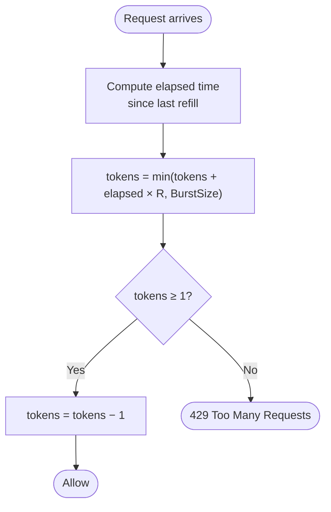
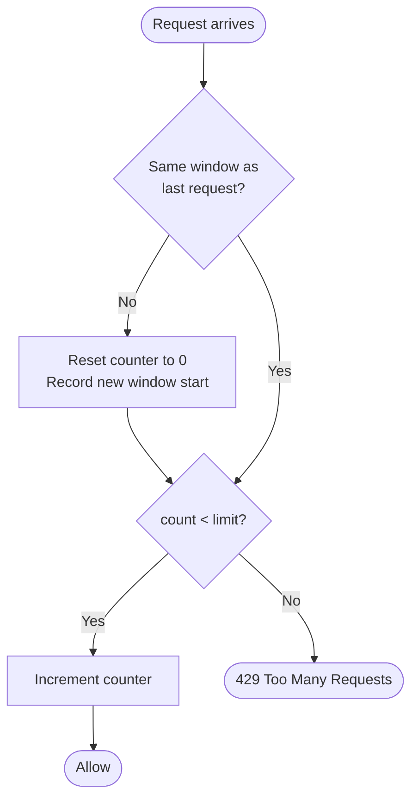
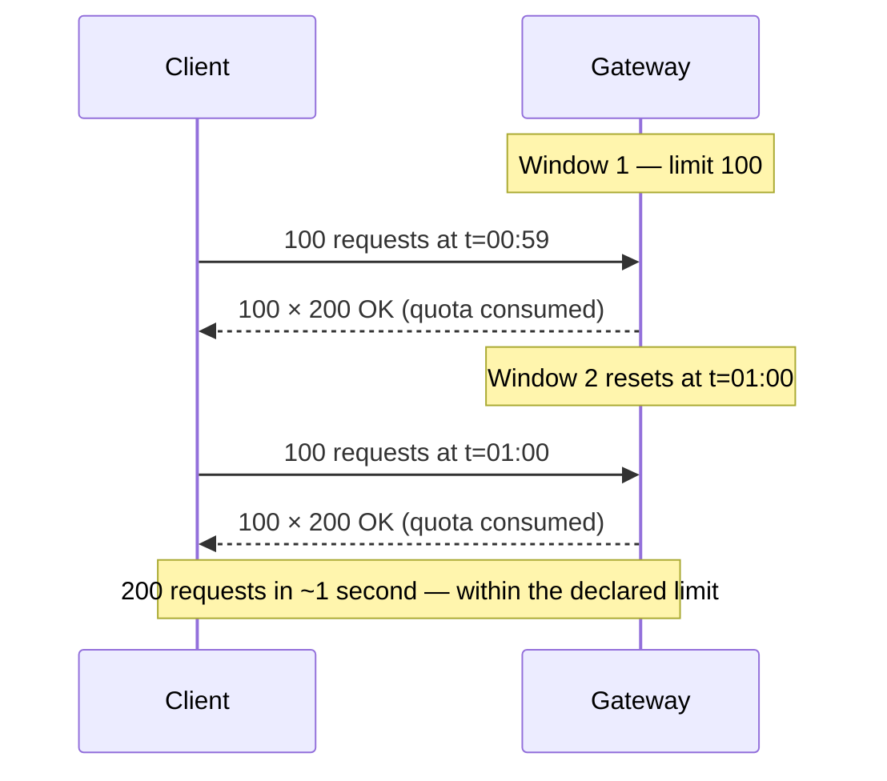
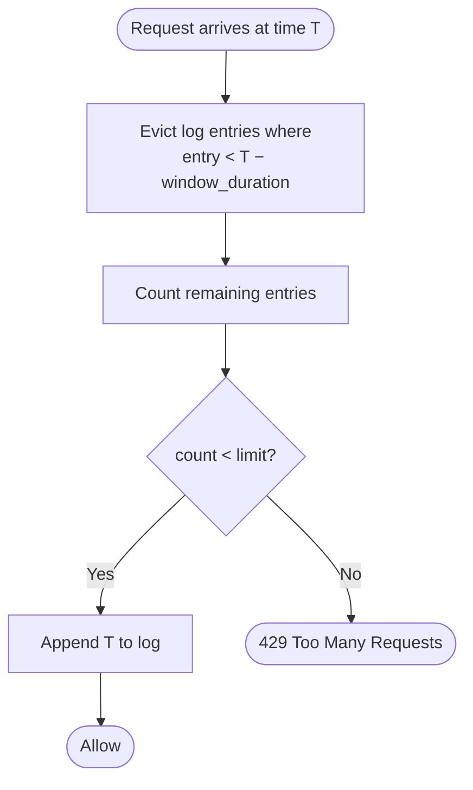
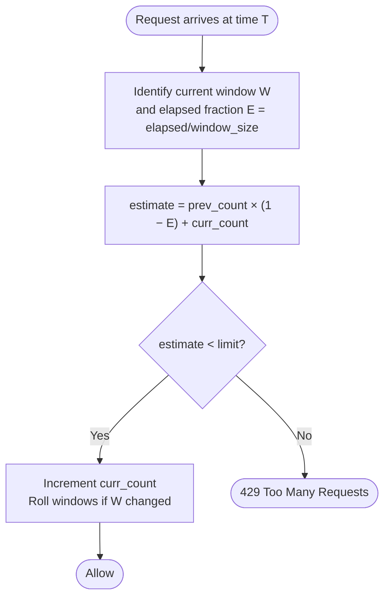
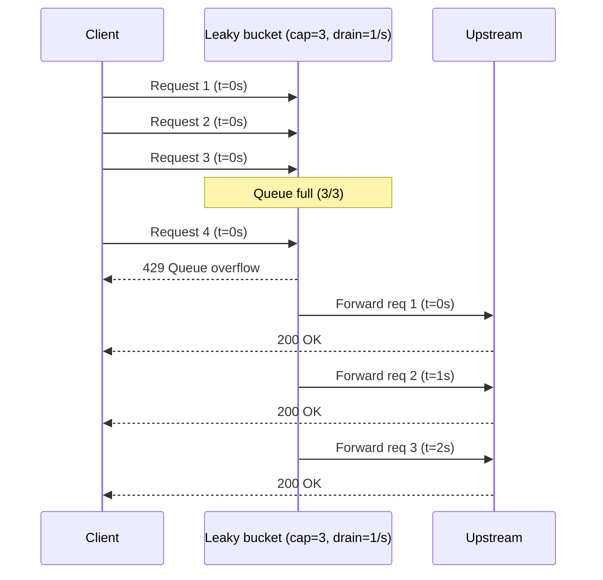
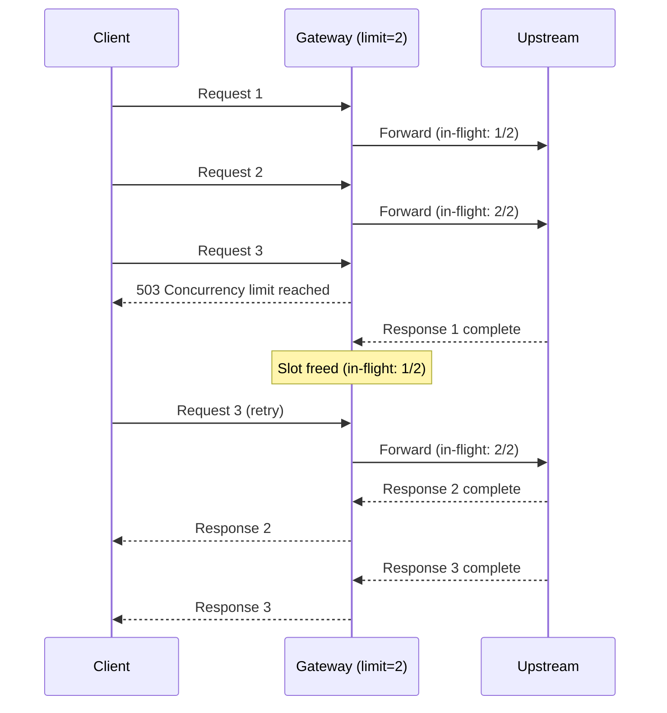

# Rate limiting strategies

Rate limiting controls how many requests a client can make within a time window. The api-gateway implements rate limiting through the `ports.RateLimiter` interface, which means any algorithm that reduces to a per-key allow/deny decision can be swapped in without changing the middleware or container.

```go
// ports/ports.go
type RateLimiter interface {
    Allow(key string) bool
}
```

The client key is extracted by `extractClientKey` in the HTTP adapter — by default it uses the client IP, but it can be configured to use a JWT subject, API key, or any header value.

---

## Current implementation: token bucket

The api-gateway ships with an in-memory token bucket backed by `golang.org/x/time/rate`. Each unique key gets its own `rate.Limiter` created lazily on first use. Stale entries are evicted after 10 minutes of inactivity.

### How it works

A client starts with `BurstSize` tokens. Each request consumes one token. Tokens refill at `RequestsPerSecond` tokens per second up to the burst cap.

```
                   refill rate: R tokens/sec
                   ┌─────────────────────────┐
                   │  capacity: BurstSize     │
  request ──────▶ │  ○ ○ ○ ○ ○ ○ ○ ○ ○ ○   │ ──▶ allow
  (consume 1)     │                           │
                   └─────────────────────────┘
                         when empty:
  request ──────▶ (no token available)        ──▶ deny (429)
```

### Decision logic



### Configuration

```yaml
rate_limit:
  enabled: true
  requests_per_second: 100
  burst_size: 200
```

`requests_per_second` is the steady-state refill rate. `burst_size` is the maximum number of tokens that can accumulate, allowing short-lived traffic spikes above the steady-state rate.

### Properties

| Property | Value |
|----------|-------|
| Allows bursts | Yes — up to `BurstSize` |
| Memory per client | O(1) — one `rate.Limiter` struct |
| Boundary spike risk | None |
| Distributable | No — in-memory only |

### When to use

Token bucket is the right default for most APIs. It allows clients to absorb short spikes (e.g., a mobile app that retries three requests simultaneously after a network interruption) without appearing to violate the limit, while still enforcing a long-run average.

---

## Fixed window counter

Count requests per client in non-overlapping fixed-duration windows. At the start of each window the counter resets to zero.

### How it works

```
  window 1 (00:00 – 00:59)   window 2 (01:00 – 01:59)
  ┌────────────────────────┐  ┌────────────────────────┐
  │ count: 0 → 1 → … → 99 │  │ count: 0 → 1 → …       │
  └────────────────────────┘  └────────────────────────┘
         limit: 100
```

A client whose counter reaches the limit is denied until the next window starts.

### Decision logic



### Boundary spike

The critical weakness of fixed window is the boundary spike. A client can make 100 requests at 00:59 (end of window 1) and another 100 requests at 01:00 (start of window 2). From the server's perspective the client made 200 requests in two seconds while staying within the declared limit.



### Properties

| Property | Value |
|----------|-------|
| Allows bursts | Yes — the full window quota is available the instant the window resets |
| Memory per client | O(1) — one counter + one timestamp |
| Boundary spike risk | High |
| Distributable | Yes — a single atomic `INCR` + `EXPIRE` in Redis |

### When to use

Fixed window is appropriate when the boundary spike is acceptable (e.g., billing or quota enforcement where precision matters less than simplicity) or when the window is very short (sub-second). Avoid it for DDoS mitigation where adversaries can time their requests to exploit the boundary.

### Interface compatibility

Fits `Allow(key string) bool` unchanged. The domain type would be:

```go
type FixedWindowRule struct {
    RequestsPerWindow int
    WindowDuration    time.Duration
}
```

---

## Sliding window log

Record a timestamp for every request per client. On each new request, discard timestamps older than `[now - window]` and count what remains.

### How it works

```
  window = 60s, limit = 100

  t=0  t=10  t=20  t=30  t=40  t=50  t=60  t=70
   │    │     │     │     │     │     │     │
  req  req   req   req   req   req   ← at t=70:
                                       discard t=0..t=9
                                       count remaining = 5
                                       allow (5 < 100)
```

Every request is logged. To evaluate `Allow`, scan and evict timestamps outside the window, then count.

### Decision logic



### Properties

| Property | Value |
|----------|-------|
| Allows bursts | No — the count at any instant reflects the true sliding window |
| Memory per client | O(N) — one entry per request within the window |
| Boundary spike risk | None |
| Distributable | Yes — Redis sorted sets (`ZADD` / `ZREMRANGEBYSCORE` / `ZCARD`) |

### When to use

Sliding window log is the most accurate algorithm. Use it when precision is critical and request volume per client is bounded. It becomes impractical when the allowed rate is high (e.g., 10,000 req/min per client) because memory grows with the number of requests in the window.

### Interface compatibility

Fits `Allow(key string) bool` unchanged. The domain type mirrors fixed window:

```go
type SlidingWindowLogRule struct {
    RequestsPerWindow int
    WindowDuration    time.Duration
}
```

---

## Sliding window counter

A hybrid of fixed window and sliding window log. Track two consecutive fixed-window counts (current and previous) and estimate the count at any instant by linear interpolation.

### How it works

```
  window = 60s, limit = 100

  previous window   current window
  ┌───────────────┐ ┌───────────────┐
  │  count = 80   │ │  count = 30   │
  └───────────────┘ └───────────────┘
           ↑ 45s elapsed in current window

  estimated count = 80 × (1 - 45/60) + 30
                  = 80 × 0.25 + 30
                  = 20 + 30
                  = 50  → allow
```

The interpolation assumes requests were uniformly distributed in the previous window, which introduces a small approximation error (empirically less than 0.003% under Cloudflare's analysis). In exchange, memory per client drops to two counters regardless of request volume.

### Decision logic



### Properties

| Property | Value |
|----------|-------|
| Allows bursts | Slight — at window boundaries the interpolation allows minor overshoot |
| Memory per client | O(1) — two counters + one timestamp |
| Boundary spike risk | Negligible — the spike is bounded by the approximation error |
| Distributable | Yes — two atomic counters in Redis (one `INCR` per request + `EXPIRE`) |

### When to use

Sliding window counter is the best general-purpose algorithm when memory efficiency matters and approximate accuracy is acceptable. It is used in production by Cloudflare, Redis (`CL.THROTTLE`), and most API management platforms. It eliminates the boundary spike of fixed window without the memory cost of sliding window log.

### Interface compatibility

Fits `Allow(key string) bool` unchanged. The domain type:

```go
type SlidingWindowRule struct {
    RequestsPerWindow int
    WindowDuration    time.Duration
}
```

---

## Leaky bucket

Requests enter a fixed-capacity queue and drain at a constant rate. Unlike token bucket, leaky bucket enforces a *smooth*, constant output rate — bursts are absorbed into the queue, not passed through.

### How it works

```
  incoming requests
        │
        ▼
  ┌──────────────┐  capacity C
  │  queue       │
  │  ○ ○ ○ ○ ○  │──▶ drain rate R req/s ──▶ upstream
  └──────────────┘
   full → overflow → deny (429)
```

When the queue is full, new requests are rejected immediately. Queued requests are processed at exactly R requests per second regardless of how fast they arrive.

### Queuing behavior

The sequence below shows how a burst of four requests is handled when the queue capacity is three and the drain rate is one per second. Notice that the upstream sees requests at a steady pace regardless of when they arrived.



### Distinction from token bucket

Token bucket allows the burst to pass through immediately (tokens are consumed at the moment of the request). Leaky bucket queues the burst and releases it at a fixed rate, smoothing the load seen by the upstream.

| Scenario | Token bucket | Leaky bucket |
|----------|-------------|--------------|
| 10 simultaneous requests, limit = 10/s, burst = 10 | All 10 pass immediately | All 10 queue; one passes every 100ms |
| Upstream sees | Spike of 10 | Smooth 10/s |

### Interface compatibility

A *rejection-only* leaky bucket (reject when queue full, no actual queuing) fits `Allow(key string) bool`. A true queuing leaky bucket does not — it requires the middleware to wait for the drain signal rather than immediately returning a 429. This would be expressed as a middleware that calls `time.Sleep` or selects on a channel, not as a `bool` return.

If you implement the rejection-only variant, the domain type would be:

```go
type LeakyBucketRule struct {
    DrainRatePerSecond float64
    QueueDepth         int
}
```

The true queuing variant would require a different port interface:

```go
type QueuingRateLimiter interface {
    // Acquire blocks until a slot is available or ctx is cancelled.
    Acquire(ctx context.Context, key string) error
}
```

### When to use

Leaky bucket (queuing) is appropriate when smooth upstream load is more important than client latency. Common in telephony systems, payment processors, and API gateways that front services with strict throughput SLAs. Avoid it when clients are latency-sensitive and should receive an immediate 429 rather than a delayed response.

---

## Concurrency limiter

All algorithms above measure *rate* (requests per unit time). A concurrency limiter measures *parallelism* — the number of requests that are simultaneously in-flight, regardless of when they arrived.

### How it works

```
  limit = 5 concurrent requests

  in-flight: [req1, req2, req3, req4, req5]  → full
  new request ──▶ deny (503 or 429)

  req3 completes ──▶ slot freed
  new request ──▶ allow
```

### Acquire / release lifecycle



### Interface change required

The current `ports.RateLimiter` interface cannot express a concurrency limiter because there is no signal for "request completed". The required interface is:

```go
type ConcurrencyLimiter interface {
    // Acquire returns true if a slot is available and reserves it.
    // The caller must call Release when the request completes.
    Acquire(key string) bool
    // Release frees the slot previously reserved by Acquire.
    Release(key string)
}
```

The middleware would call `Acquire` before the handler and `defer Release` to free the slot on completion (including on panic, via the recovery middleware upstream in the chain).

### Properties

| Property | Value |
|----------|-------|
| Measures | In-flight parallelism, not rate |
| Memory per client | O(1) — one counter |
| Protects against | Slow requests that pile up and exhaust connection pools |
| Distributable | Yes — Redis `INCR` / `DECR` with a ceiling check in a Lua script |

### When to use

Concurrency limiting is complementary to rate limiting, not a replacement. Use it to protect upstreams that are sensitive to the number of simultaneous connections (database connection pools, CPU-bound services) rather than to the number of requests per second. Combine with token bucket: the rate limiter prevents request storms, the concurrency limiter prevents slow-request pile-ups.

---

## Distributed (Redis-backed) variants

All in-memory implementations above have the same limitation documented in [ADR-0005](adr/0005-adapter-scalability-contract.md): each gateway replica maintains independent state, so a client can exceed the declared limit by a factor of N (where N is the number of replicas).

Any of the algorithms above can be made distribution-safe by moving the shared state to Redis. The implementation swaps only the adapter — the `ports.RateLimiter` interface and the middleware are unchanged.

| Algorithm | Redis primitive |
|-----------|----------------|
| Token bucket | `CL.THROTTLE` command (Redis Cell module) or Lua script with `INCRBY` + `EXPIRE` |
| Fixed window counter | `INCR` + `EXPIRE` |
| Sliding window log | Sorted set: `ZADD` / `ZREMRANGEBYSCORE` / `ZCARD` |
| Sliding window counter | Two keys with `INCR` + `EXPIRE`, one per window |
| Concurrency limiter | `INCR` / `DECR` with a ceiling check in a Lua script |

The Redis adapter would live in `services/api-gateway/internal/adapters/outbound/redis/` and implement `ports.RateLimiter` with the same `Allow(key string) bool` signature. The container selects it when `GATEWAY_REDIS_URL` is set, falling back to the in-memory adapter otherwise — the same fallback pattern used by `authorization-policy-service` for its cache.

---

## Algorithm comparison

| Algorithm | Memory/client | Boundary spike | Burst allowed | Interface change needed |
|-----------|--------------|----------------|---------------|------------------------|
| Token bucket (current) | O(1) | None | Yes | — |
| Fixed window counter | O(1) | High | Yes | No |
| Sliding window log | O(N requests) | None | No | No |
| Sliding window counter | O(1) | Negligible | No | No |
| Leaky bucket (reject-only) | O(1) | None | No | No |
| Leaky bucket (queuing) | O(queue depth) | None | No (absorbed) | Yes — needs `Acquire(ctx)` |
| Concurrency limiter | O(1) | N/A | N/A | Yes — needs `Release` |

---

## Adding a new strategy

All rate limiters live in `services/api-gateway/internal/adapters/outbound/`. To add a new strategy:

1. Create a new package (e.g., `adapters/outbound/slidingwindow/`).
2. Implement `ports.RateLimiter` (or the new interface if the algorithm requires it).
3. Add a compile-time check: `var _ ports.RateLimiter = (*RateLimiter)(nil)`.
4. Add a domain type for the configuration in `internal/domain/ratelimit.go`.
5. Add a config field in `internal/config/config.go` and parse it from `gateway.yaml`.
6. Select the adapter in `internal/container/container.go` based on the config field.

Nothing outside the container changes. The middleware, routes, and handler are unaware of which algorithm is active.
