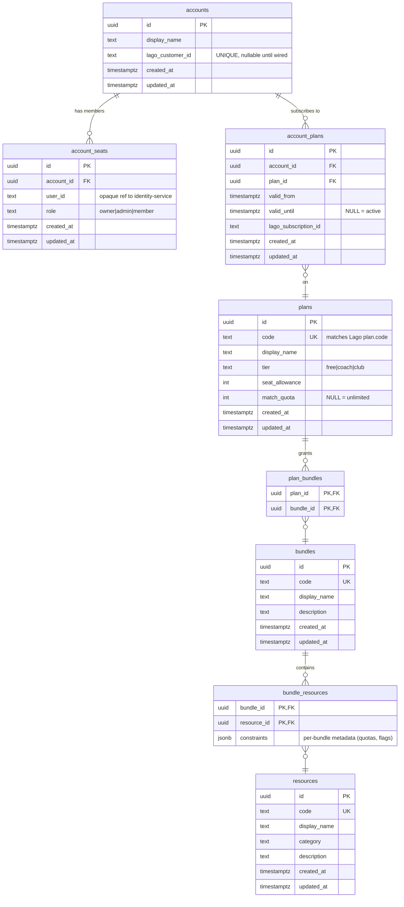

# entitlements-service — Postgres schema

Physical schema for the entitlements catalog + tenant state. Anchors
[ADR-0028](../../../docs/adr/0028-entitlements-model.md); implemented by
`internal/adapters/outbound/postgres/migrations/000001_*.sql`.

## Entity relationships



## Table-by-table notes

### `resources`, `bundles`, `plans` — the catalog

Nearly-static reference tables edited by ops/admins (E3-S3 seeds them).
`code` is the stable external identifier for cross-service references
(auth-server claims, Lago plan mirror, admin UI).

- `plans.code` **matches Lago's plan.code exactly** — this is the join
  key between billing and entitlements.
- `plans.tier` gates coarse "is Coach or better?" JWT-claim checks per
  ADR-0028 decision 2.
- `plans.match_quota` and `plans.seat_allowance` are the enforcement
  contract per ADR-0027. Copy from `infra/lago/plans/*.json`
  `metadata.*` when seeding.

### `bundle_resources.constraints` (JSONB)

Bundles grant resources but may attach per-membership metadata — a
`touchline-core` bundle might grant the `match_review` resource with
`{"quota": 3}` while `touchline-hd` grants it with `{"hd_output": true}`.

Kept as JSONB because the shape varies per resource type; the auth-time
resolver reads whatever keys the resource type expects.

### `accounts` and `account_seats`

Multi-seat model per ADR-0028 decision 1. `accounts` is the billing
entity (1:1 with Lago customer via `lago_customer_id`), `account_seats`
holds member users.

- `user_id` is an opaque TEXT ref, **not** a foreign key —
  `entitlements-service` does not own the user record, `identity-service`
  does. Cross-service FKs would couple databases.
- `(account_id, user_id)` UNIQUE prevents a user from occupying two
  seats in the same account.
- `role` is app-level (owner/admin/member); auth roles like `agent`
  (per ADR-0015) live on the JWT, not here.

### `account_plans` — historical subscription state

Not just "current plan" — the full history is retained for
audit/reporting and to answer "what did they have on <date>?".

- `valid_until IS NULL` = currently active. Partial index
  `account_plans_active_idx` keeps the "give me the active plan"
  lookup fast (targets the ~one row per account matching this
  predicate).
- `CHECK (valid_until > valid_from)` prevents nonsense ranges.
- `UNIQUE (account_id, plan_id, valid_from)` makes Lago webhook
  replays idempotent — reprocessing "subscription created at T" for
  the same plan on the same account is a no-op.
- `lago_subscription_id` is the join key back to Lago. Nullable
  because manual grants (comp'd plans, incidents) don't have one.

## Index inventory

Required by story #155:

| Index                                       | Table              | Column(s)                        | Purpose                                          |
|---------------------------------------------|--------------------|----------------------------------|--------------------------------------------------|
| `account_seats_user_id_idx`                 | `account_seats`    | `(user_id)`                      | "which accounts is this user a seat in?" (auth)  |
| `account_plans_account_valid_until_idx`     | `account_plans`    | `(account_id, valid_until)`      | historical lookup at a point in time             |
| `bundle_resources_resource_id_idx`          | `bundle_resources` | `(resource_id)`                  | "which bundles grant this resource?" (catalog)   |

Additional index added beyond AC:

| Index                                       | Table              | Column(s)                        | Purpose                                          |
|---------------------------------------------|--------------------|----------------------------------|--------------------------------------------------|
| `account_plans_active_idx` (partial)        | `account_plans`    | `(account_id) WHERE valid_until IS NULL` | fast "current plan" lookup — the 80% query at auth time |

## Migration

Apply / roll back via `golang-migrate`:

```bash
# Up (create schema)
migrate -database "$ENTITLEMENTS_DATABASE_URL" \
  -path services/entitlements-service/internal/adapters/outbound/postgres/migrations \
  up

# Down (drop schema)
migrate -database "$ENTITLEMENTS_DATABASE_URL" \
  -path services/entitlements-service/internal/adapters/outbound/postgres/migrations \
  down
```

## What this schema deliberately does NOT model

- **Users** — owned by `identity-service`. `account_seats.user_id` is
  an opaque reference.
- **Usage counters** — Lago is the aggregation surface for metered
  usage (per ADR-0019). `entitlements-service` reads current usage
  from Lago at check time; it does not double-count.
- **Feature flags / kill switches** — not entitlements. Belongs in a
  feature-flag service (LaunchDarkly, GrowthBook, etc.).
- **Roles across services** — auth-server's client roles are separate
  from `account_seats.role`. This role is scoped to the account, not
  the OAuth token.
